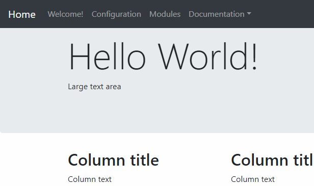
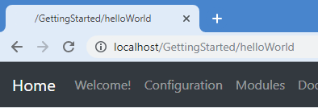
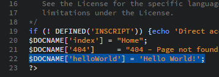
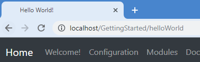

##### Setting a title
Now, we need to give our page a proper title. This will need to be done in two steps. First, we will set the title that is shown in our page. Next, we will set it in the `docname.inc.php` file so that the browser's title is changed too. 
To set the title that is shown in our page, all we need to do is to change `Page title` to what we want. For this example, change it to *Hello World!*. 
If you access the page using your web browser, it should now show the title you just wrote. Just like this: 

Now to set it in our browser. If you take a look at the top of your browser's window, you will notice that we have the path instead of a title. That's because, when the Framework doesn't know what to display here, it takes the second part of the URL. 

To change it, open the `docname.inc.php` file for editing. This file only stores an array of different strings with their matching pages' file names. As you can see, we don't have any line that match our new page, so we need to add it. Add `$DOCNAME['helloWorld'] = 'Hello World!';` just after the last line: 

This adds an entry to the `$DOCNAME` array which is used by the Framework to set the page title in the theme's header. Our page's name is the *key* and the title is the *value* in this case. 
Now refresh the page in your browser. And...  

... magic happened! 
Our browser is now showing the correct title! 
Of course, we don't need to use the same title than our web page here. They don't need to match and you can be original here.

Now that our title is set, it is time to put some content.

[Previous](./Page02-TheScript) | [Next](./Page04-AddingSomeContent)