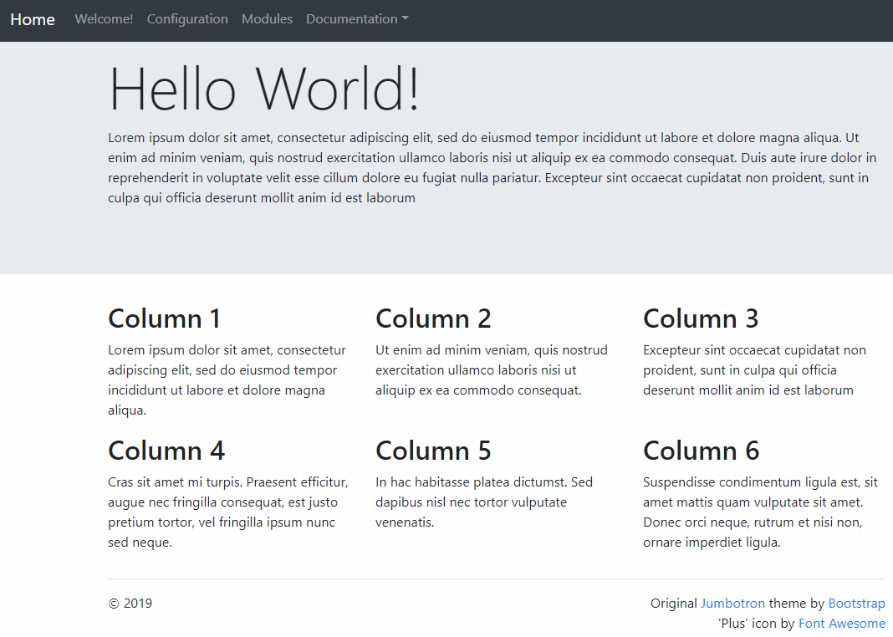

##### Adding some content
Since this is a simple HTML page, this will be straightforward. Our template comes with a large text area where you can put a long text, like a description, and two columns. You can change the text to whatever you like and even add columns by simply copying the code.

Here is an example of a page with three columns but one row:<br/>


```html
<main role="main">

  <div class="jumbotron">
    <div class="container">
      <h1 class="display-3">Hello World!</h1>
      <p>Lorem ipsum dolor sit amet, consectetur adipiscing elit, sed do eiusmod tempor
          incididunt ut labore et dolore magna aliqua. Ut enim ad minim veniam, quis 
          nostrud exercitation ullamco laboris nisi ut aliquip ex ea commodo consequat.
          Duis aute irure dolor in reprehenderit in voluptate velit esse cillum dolore
          eu fugiat nulla pariatur. Excepteur sint occaecat cupidatat non proident, 
          sunt in culpa qui officia deserunt mollit anim id est laborum</p>
    </div>
  </div>

  <div class="container">
    <!-- Example row of columns -->
    <div class="row">
      <div class="col-md-4">
        <h2>Column 1</h2>
        <p>Lorem ipsum dolor sit amet, consectetur adipiscing elit, sed do eiusmod tempor
          incididunt ut labore et dolore magna aliqua.</p>
      </div>
      <div class="col-md-4">
        <h2>Column 2</h2>
        <p>Ut enim ad minim veniam, quis 
          nostrud exercitation ullamco laboris nisi ut aliquip ex ea commodo consequat.</p>
      </div>
      <div class="col-md-4">
        <h2>Column 3</h2>
        <p>Excepteur sint occaecat cupidatat non proident, 
          sunt in culpa qui officia deserunt mollit anim id est laborum</p>
      </div>
    </div>
    <hr>
  </div>
</main>
```
Here is the same example, but with two rows:<br/>


```html
<main role="main">

  <div class="jumbotron">
    <div class="container">
      <h1 class="display-3">Hello World!</h1>
      <p>Lorem ipsum dolor sit amet, consectetur adipiscing elit, sed do eiusmod tempor
          incididunt ut labore et dolore magna aliqua. Ut enim ad minim veniam, quis 
          nostrud exercitation ullamco laboris nisi ut aliquip ex ea commodo consequat.
          Duis aute irure dolor in reprehenderit in voluptate velit esse cillum dolore
          eu fugiat nulla pariatur. Excepteur sint occaecat cupidatat non proident, 
          sunt in culpa qui officia deserunt mollit anim id est laborum</p>
    </div>
  </div>

  <div class="container">
    <!-- Example row of columns -->
    <div class="row">
      <div class="col-md-4">
        <h2>Column 1</h2>
        <p>Lorem ipsum dolor sit amet, consectetur adipiscing elit, sed do eiusmod tempor
          incididunt ut labore et dolore magna aliqua.</p>
      </div>
      <div class="col-md-4">
        <h2>Column 2</h2>
        <p>Ut enim ad minim veniam, quis 
          nostrud exercitation ullamco laboris nisi ut aliquip ex ea commodo consequat.</p>
      </div>
      <div class="col-md-4">
        <h2>Column 3</h2>
        <p>Excepteur sint occaecat cupidatat non proident, 
          sunt in culpa qui officia deserunt mollit anim id est laborum</p>
      </div>
    </div>
    <div class="row">
      <div class="col-md-4">
        <h2>Column 4</h2>
        <p>Cras sit amet mi turpis. Praesent efficitur, augue nec fringilla consequat, est 
            justo pretium tortor, vel fringilla ipsum nunc sed neque.</p>
      </div>
      <div class="col-md-4">
        <h2>Column 5</h2>
        <p>In hac habitasse platea dictumst. Sed dapibus nisl nec tortor vulputate venenatis.</p>
      </div>
      <div class="col-md-4">
        <h2>Column 6</h2>
        <p>Suspendisse condimentum ligula est, sit amet mattis quam vulputate sit amet. Donec
            orci neque, rutrum et nisi non, ornare imperdiet ligula.</p>
      </div>
    </div>
    <hr>
  </div>
</main>
```

[Previous](./Page03-SettingATitle) | [Next](./Page05-CreatingAThemeFunction)