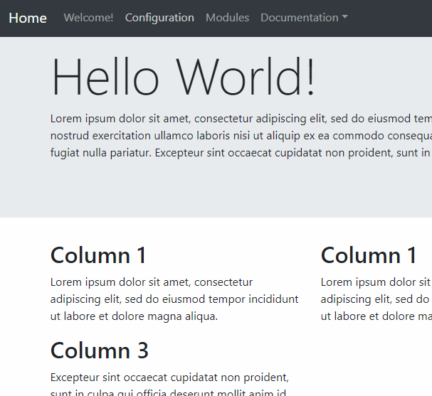

##### Using a theme's function
Now that we created our function, we can 'convert' our existing HTML code to use it.<br/>
Go back to the `helloWorld.html` file and create a new line between the first `<div class="row">` and `<div class="col-md-4">`.<br/>
Now type `<?php echo theme_column(title, text); ?>`. Replace *title* with the the title of the first column and *text* with its text, both within quotes.<br/>
Save the file and test it in your browser.<br/>

If it worked, you should see something like this:<br/>



If you've got an error, check your code again and see if you mistyped something. If you don't know what's wrong, you can compare your code with the complete one below.<br/>


Now, you can 'convert' each columns to use the new function and delete the 'old' code. When you're done, check the result in your browser. You should get the exact same page than with the previous way. Only this time. it is being dynamically generated! (ok... not really, but you could connect to a database and use your new function to display data from a query)<br/>

The final code should look like this:
```html
<main role="main">

  <div class="jumbotron">
    <div class="container">
      <h1 class="display-3">Hello World!</h1>
      <p>Lorem ipsum dolor sit amet, consectetur adipiscing elit, sed do eiusmod tempor
          incididunt ut labore et dolore magna aliqua. Ut enim ad minim veniam, quis 
          nostrud exercitation ullamco laboris nisi ut aliquip ex ea commodo consequat.
          Duis aute irure dolor in reprehenderit in voluptate velit esse cillum dolore
          eu fugiat nulla pariatur. Excepteur sint occaecat cupidatat non proident, 
          sunt in culpa qui officia deserunt mollit anim id est laborum</p>
    </div>
  </div>

  <div class="container">
    <!-- Example row of columns -->
    <div class="row">
        <?php 
        echo theme_column('Column 1', 'Lorem ipsum dolor sit amet, consectetur adipiscing elit, sed do eiusmod tempor incididunt ut labore et dolore magna aliqua.');
        echo theme_column('Column 2', 'Ut enim ad minim veniam, quis nostrud exercitation ullamco laboris nisi ut aliquip ex ea commodo consequat.');
        echo theme_column('Column 3', 'Excepteur sint occaecat cupidatat non proident, sunt in culpa qui officia deserunt mollit anim id est laborum.');
        ?>
    </div>
    <div class="row">
        <?php
        echo theme_column('Column 4', 'Cras sit amet mi turpis. Praesent efficitur, augue nec fringilla consequat, est justo pretium tortor, vel fringilla ipsum nunc sed neque.');
        echo theme_column('Column 5', 'In hac habitasse platea dictumst. Sed dapibus nisl nec tortor vulputate venenatis.');
        echo theme_column('Column 6', 'Suspendisse condimentum ligula est, sit amet mattis quam vulputate sit amet. Donec orci neque, rutrum et nisi non, ornare imperdiet ligula.'); ?>
    </div>
    <hr>
  </div>
</main>
```

**Some additional information**: Our function is using [return](http://php.net/manual/en/function.return.php) to give back our rendered HTML. We **could** use `echo` directly and output the result straight to the browser and skip having to write `echo` in front of every call (which would increase performance a little, in some cases). <br/>
But, with `return`, our web page is not the only thing that can call it. A module may very well use this function for any reason. One could, for example, cache the result and be used as a permanent caching system for our web pages, avoiding rendering the HTML again every time we use our function with static text, increasing performance a lot when you have a lot of static content (especially if you can use the web server's memory to store data, instead of using the disk).<br/>
For that reason, themes are built to return the result instead of outputting it. Of course, there is no restriction within the Framework that will prevent you from doing it the other way if you prefer.<br/>

[Previous](./Page05-CreatingAThemeFunction) | [Next](./Page07-CreatingABasicModule)